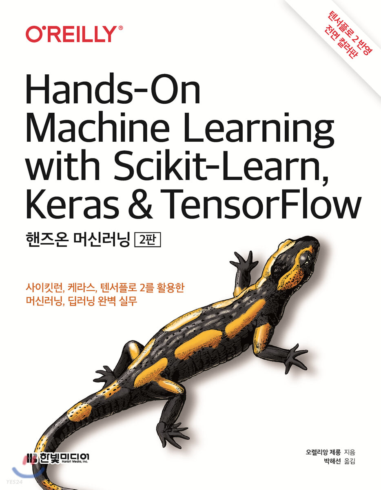

# 2021_HAI_HandsOn_ML
### HAI 2021: Hands-On Machine Learning Lecture

This repository includes lecture materials for HAI 2021 Machine Learning class.

- Book: Hands-On Machine Learning with Scikit-Learn Keras & Tensorflow
(핸즈온 머신러닝 2판)
(출판사: 한빛미디어)

- Period: summer vacation, and 2nd semester

- Lecturer: Gaon Choi
